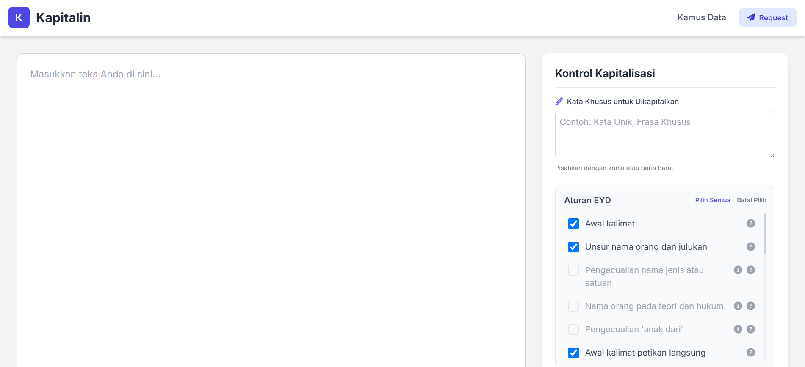
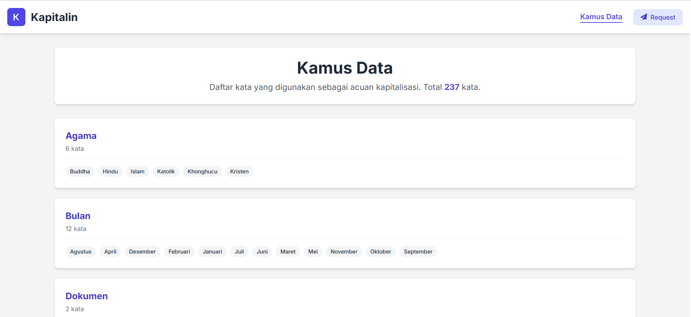

# 🚀 Kapitalin: Automatic Capitalization (Web App)

A simple and free web-based tool designed to automatically check and correct capitalization in Indonesian text according to the official grammar rules (EYD V).

## ✨ Key Features

* **Rule-Based Correction:** Automatically capitalizes text based on selectable Indonesian grammar rules (EYD).
* **Custom Dictionary:** Allows users to add their own custom words or phrases to be capitalized.
* **Toggleable Rules:** Users can enable or disable specific capitalization rules to fit their needs.
* **Real-time Stats:** Provides instant character and word counts for the input text.
* **Data Dictionary:** Includes a searchable page to view all the built-in words used for capitalization.
* **Responsive Design:** Clean and accessible user interface on both desktop and mobile devices.

## 💻 Application Preview


*Home page.*

*Dictionary page.*

## 🛠️ Tech Stack

The main technologies used in this project include:

* **Frontend:**
    * HTML5
    * Tailwind CSS
    * Vanilla JavaScript (ES6+)

*This is a client-side only application and does not require a backend or database.*

## ⚙️ Installation & Setup

Follow these steps to get the project running on your local machine:

1.  **Clone this repository:**
    ```bash
    git clone https://github.com/fandipres/kapitalin.git
    cd kapitalin
    ```

2.  **Run the application:**
    
    No special installation is needed. Simply open the `index.html` file in your web browser.
    ```bash
    # On Windows
    start index.html

    # On macOS
    open index.html
    ```

3.  The application should now be running in your browser.

## 🔗 Links

* **Live Demo:** [fandipres.github.io/kapitalin](https://fandipres.github.io/kapitalin)
* **Repository:** [github.com/fandipres/kapitalin](https://github.com/fandipres/kapitalin)

## 📄 License

This project is licensed under the [MIT License](https://opensource.org/licenses/MIT).